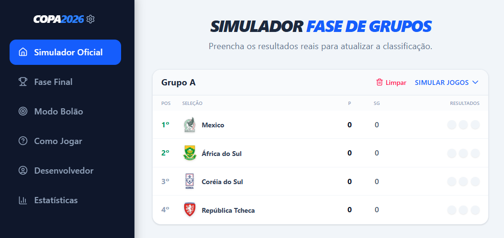
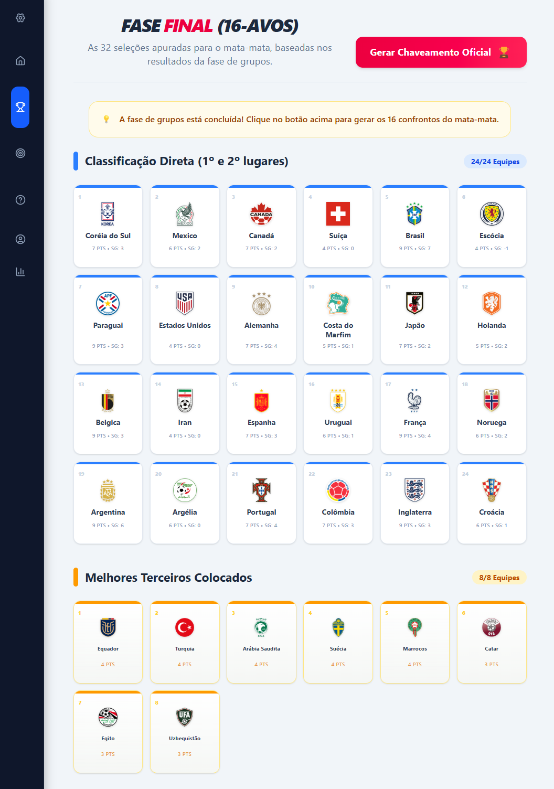

# 🏆 Simulador Copa 2026 & Modo Bolão


Uma aplicação web interativa e responsiva para simular o Campeonato do Mundo de 2026. Este projeto inclui a simulação completa da fase de grupos, um motor dinâmico para as eliminatórias (mata-mata) e um sistema completo de gestão de palpites (Bolão) com regras de pontuação avançadas.

---

## 📸 Demonstração Visual

*(Adicione aqui um pequeno GIF a demonstrar a utilização ou alguns prints do seu ecrã)*
<p align="center">
  
  
</p>

---

## 🚀 Funcionalidades Principais

* **Simulador Oficial:** Atualização em tempo real das tabelas da fase de grupos. O algoritmo calcula automaticamente as classificações seguindo as regras oficiais da FIFA (Pontos > Saldo de Golos > Golos Marcados).
* **Motor de Eliminatórias (Mata-Mata):** Geração automática do chaveamento a partir dos 16-avos de final. Inclui suporte a desempates por penáltis e ramificação inteligente de vencedores/perdedores (ex: disputa de 3º lugar).
* **Modo Bolão (Sweepstakes):** Gestão de múltiplos participantes. O sistema compara os palpites dos utilizadores com os resultados oficiais e aplica um algoritmo de **pontuação com multiplicadores por fase** (jogos da final valem 10x mais que jogos da fase de grupos).
* **Estatísticas Globais (Matrix Layout):** Uma *Leaderboard* de todas as 48 seleções. Desenvolvida com técnicas avançadas de CSS (colunas e cabeçalhos fixos via `sticky`) para uma rolagem perfeita em dispositivos móveis.
* **Persistência Local (Offline-First):** Utilização do IndexedDB para garantir que o estado do torneio, configurações e participantes não se percam quando a página é recarregada.

---

## 🛠️ Arquitetura e Decisões Técnicas

Este projeto é um remake moderno de um sistema antigo construído em JavaScript puro. Foi arquitetado para demonstrar maturidade no desenvolvimento Front-End:

* **Dexie.js (IndexedDB):** Escolhido no lugar do `localStorage` para permitir armazenamento robusto e transações ACID no lado do cliente.
* **Tipagem Estrita (TypeScript):** Assegura contratos de dados consistentes em todo o ciclo de vida dos jogos, garantindo que o avanço das equipas na árvore de eliminatórias seja 100% determinístico e sem erros de runtime.
* **Mobile-First UX (Tailwind):** Implementação de padrões da indústria para UX móvel, incluindo uma *Bottom Navigation Bar* em telemóveis que se transforma de forma fluida numa *Sidebar* expansível em ecrãs maiores.
* **Design System Centralizado:** Variáveis de cores e tipografia isoladas na raiz do CSS, facilitando manutenção e escalabilidade futura.
* **Gestão de Pacotes:** Utilização do `pnpm` para builds mais rápidos e gestão de dependências ultra-eficiente.

---

## 💻 Como Executar o Projeto Localmente

### Pré-requisitos
* [Node.js](https://nodejs.org/) (v16 ou superior)
* [pnpm](https://pnpm.io/pt/) instalado globalmente (`npm install -g pnpm`)

### Instalação

1. Clone este repositório:
```bash
git clone [https://github.com/1felipeaac/simulador-copa-2026.git](https://github.com/1felipeaac/simulador-copa-2026.git)
```

### 👨🏽‍💻 Sobre o Desenvolvedor

**Felipe Augusto** Desenvolvedor FullStack (Java / Node.js / React)

Sou um desenvolvedor apaixonado por construir ecossistemas robustos e interfaces inteligentes. Tenho experiência prática em transitar entre o backend escalável (Spring Boot, Node.js) e frontends modernos, reativos e de alta performance.

- 💼 LinkedIn: linkedin.com/in/1felipeaac
- 🔗 GitHub: github.com/1felipeaac

Este projeto foi criado com **fins de estudo e portfólio**. **Não** possui afiliação oficial com a FIFA.